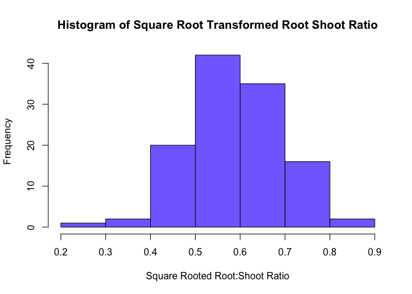
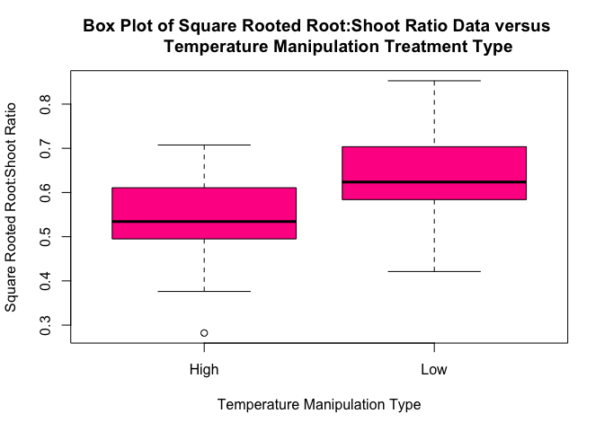
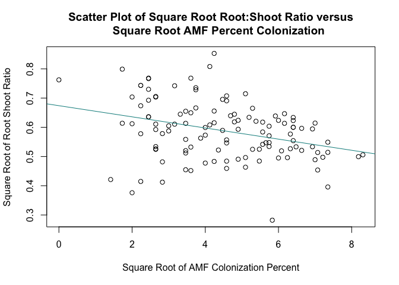
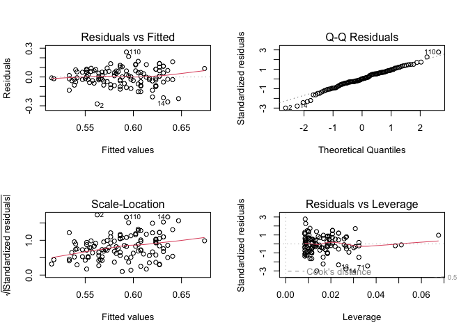
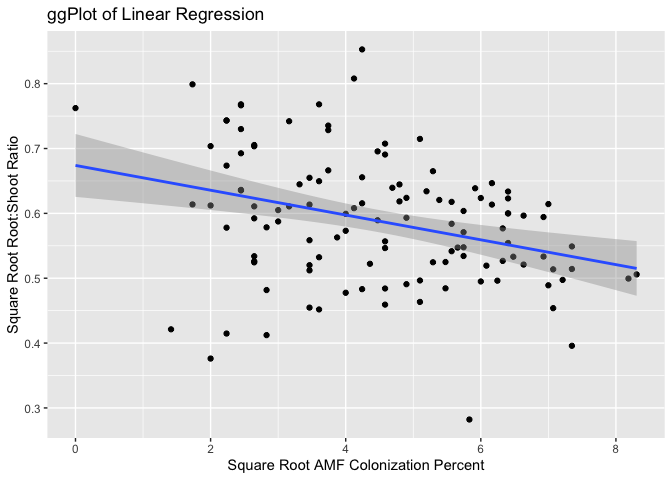

Oh Shoot! Should I Grow My Roots?<br> </span><br> </span>
<span style="font-size:18px; font-weight:normal;"> How Changes in
Environmental Conditions Affect Plant Root:Shoot Ratios
<span style="font-size:16px; font-weight:normal; color:gray;">
================
Emma Cardoso
March 2023 - EEMB 146 Final Project

## Abstract

Soil communities have profound impacts on their surrounding habitats and
play a critical role in maintaining the stability of Earth’s ecosystems.
Thus, it is essential that the health of these communities is preserved
as environmental conditions change in light of climate change. To
understand how soil-microbe interactions may be effected by climate
change, researchers at Stockholm University and the Ohio State
University conducted an experiment in which seeds/plants were exposed to
different temperature and soil moisture conditions. Motivated by a
personal love for preserving the environment and fascination with
microbes, I focused on the variables “temperature manipulation type” and
“Arbuscular Mycorrhizal Fungi (AMF) percent colonization” from the data
set to investigate how these variables effect the “plant root:shoot
ratio” variable. The data was analyzed with a two-sample t-test using
the categorical variable of temperature manipulation type, and a linear
regression model using the numeric variable of AMF percent colonization.
The results of these statistical analyses conclude that temperature does
have a significant impact on plant root:shoot ratio, and AMF percent
colonization is a significant predictor of root:shoot ratio.

## Introduction

This dataset was gathered by researchers at Stockholm University and the
Ohio State University while examining the impact of changing
environmental conditions on soil-microbe interactions. This data was
collected as a part of a study that was then published in the British
Ecological Society’s Journal of Ecology and is title “The impact of
elevated temperature and drought on the ecology and evolution of
plant–soil microbe interactions”.

Soil communities have profound influences on plant communities,
biodiversity, and ecosystem function; therefore, maintaining healthy
soil communities is vital for the stability of Earth’s ecosystems
(Rasmussen et al. 2019). As climate change intensifies, such ecosystems
will be forced to endure increased temperatures and changing rainfall
patterns. The purpose of this study is to investigate the effects of
increased temperature and soil moisture on plant-microbe interactions,
root-shoot ratio and percent of root colonized by Arbuscular Mycorrhizal
Fungi (AMF). Root:shoot ratio is the measurement comparing an individual
plant’s amount of root tissue to shoot tissue. This ratio typically
reflects the plant’s availability to receive the necessary nutrients for
growth as when nutrients are easily accessible, plant’s allocate their
resources towards growing their shoots (resulting in increased shoot
biomass and lower root:shoot ratio), whereas if this is not the case,
resources will be allocated towards growing roots in an attempt to
increase nutrient uptake (thereby increasing root biomass and yielding a
higher root:shoot ratio) (Agren et al. 2003). AMF colonization relates
to the percentage of which an individual plant’s roots has been
colonized by the fungi. Generally, Arbuscular Mycorrhizal Fungi form
symbiotic relationships with plant roots where fungi provide the plant
with nutrients, improving plant growth and resistance to environmental
stressors, and in return the plant provides carbohydrates to the fungi
(Jansa et al. 2008).

The data in this study was acquired via a reciprocal multifactorial
growth chamber experiment in which temperature and soil moisture were
manipulated on seeds originating from three different locations.
Temperature treatment included subjecting seeds/plants to high
temperatures (25C) or low temperatures (15C). Soil treatment included
subjecting seed/plants to high soil moisture (40% water volume) or low
soil moisture (10% water volume). 19 days after sowing, the number,
length, and width of the longest leaf was collected for each plant, 74
days after sowing rosette shape was measured, and 80 days after sowing
plants were harvested and leaves and roots were separated to calculate
leaf biomass, root dry weight, and root shoot ratio. The harvested roots
were then used to determine AMF root colonization. I will be focusing on
118 data points for seeds/plants exposed to temperature manipulations.

I hypothesize that increasing temperature will have a significant effect
on the plant root:shoot ratio. Additionally, I hypothesize that the
percent of Arbuscular Mycorrhizal Fungi colonization will be able to
predict root:shoot ratio.

\*note : seeds are exposed to a given treatment type and as these seeds
develop into plants, the plants remain exposed to the same treatment.
Thus, I will refer to this as seeds/plants throughout this paper to
highlight how both forms of the individual experienced the manipulation.

## Exploratory Data Analysis

#### Histogram

I began by creating a histogram for my y-variable, Root:Shoot Ratio, to
explore the distribution of my outcome of interest. In order to ensure
the data is normally distributed, a Square-Root transformation was
applied to the root:shoot data. As the histogram takes on a bell-shaped
curve and there are no visible outliers, we can reasonably conclude that
the data is normally distributed. While there does appear to be a slight
left skew, as this skew is weak and the data comes from a large random
sample including 118 data points, adhering to the Central Limit Theorem,
we can proceed under the assumption that the data is normal.

<figure>

<figcaption aria-hidden="true">Figure 1. Histogram depicting square root
transformed root:shoot ratio. As the distribution of the histogram
resembles a bell-shaped curve, and because the sample size allows for
the adherenece of the Central Limit Theorem, the slight left skew can be
deemed insignificant and we can conclude that the data is
normal.</figcaption>
</figure>

#### Boxplots

To further visualize the data in a meaningful way, a boxplot was created
to compare the differences in square root root:shoot ratio between
seeds/plants exposed to high temperature treatment versus seeds/plants
exposed to low temperature treatment. The boxplot shows that
seeds/plants exposed to low temperatures generally have a greater
root:shoot ratio than those exposed to high temperatures. Additionally,
the low temperature treatment appears to have a larger spread than the
high tempearture treatment. The high temperature treatment has one
outlier, whereas the low temperature treatment has no outliers. As both
box-plots look rather symmetrical, it is likely that the assumption of
normality is met.

<figure>

<figcaption aria-hidden="true">Figure 2. Boxplot comparing the square
root transformed root:shoot ratio for seeds/plants exposed to high
temperatures vesus low temperature conditions. Low temperature treatment
posesses generally larger square root root:shoot ratio and does not
contain any outliers, whereas the high temperature treatment posesses
one outlier and seems to have a smaller spread.</figcaption>
</figure>

#### Scatterplot

To visualize the relationship between square root root:shoot ratio and
square root percent AMF colonization, the numeric x variable, a
scatterplot was created. The data points in the scatter plot seem to be
somewhat spread out, though it appears that these points because more
centralized as the percent of AMF colonization increases. When adding a
trendline to the scatterplot, the line has a negative slope, meaning
that a negative correlation between the two variables may exist.

<figure>

<figcaption aria-hidden="true">Figure 3. Scatterplot depicting the
relationship between square root root:shoot ratio and square root AMF
percent colonization. As the trendline for this plot has a negative
slope, a negative correleation between the two variables may
exist.</figcaption>
</figure>

## Statistical Methods

#### Two Sample T-Test

Generally speaking, two-sample t-tests compares the means of two groups.
While there are five different types of two-sample t-tests,
conveniently, the one will be focusing on is called “two-sample t-test”.
A two-sample t-test compares whether the means of two groups are
significantly different or not. In order to continue with a two-sample
t-test, the following assumptions must be met:

1.  Assumes that the observations from each group represent a random
    sample from the population
2.  Assumes that the observations follow a normal distribution
3.  Assumes that the observations from the two groups have the same
    variance

The hypotheses for a two-sample t-test are as follows:

Null hypothesis : the mean of group A = the mean of group B
$H_0 : \mu_A = \mu_B$

Alternative hypothesis: the mean of group A $\neq$ the mean of group B
$H_A : \mu_A \neq \mu_B$

In order to reject the null hypothesis and conclude that there is a
significant difference between the means of the two groups, the t-test
must produce a p-value \< 0.05

A two-sample t-test was be used to determine if there is a significant
difference in the mean square root root:shoot ratio between seeds/plants
subjected to high temperature treatments versus low temperature
treatments.

##### Does temperature influence square root root:shoot ratio?

A two-sample t-test was run to determine if there was a significant
difference in the mean square root root:shoot ratio for seeds/plant
exposed to high temperature treatments versus seeds/plants exposed to
low temperature treatments. The hypotheses for this test are:

Null hypothesis : the mean square root root:shoot ratio for high
temperature treatments = the mean square root root:shoot ratio for low
temperature treatments $H_0 : \mu_HTemp = \mu_LTemp$

Alternative hypothesis : the mean square root root:shoot ratio for high
temperature treatments $\neq$ the mean square root root:shoot ratio for
low temperature treatments $H_A : \mu_HTemp \neq \mu_LTemp$

A two-sample t-test can be utilized as all assumptions have been met.
The random sampling assumption is met via the experimental design as the
data comes from a random sample and seeds were assigned treatment
manipulations at random. The assumption for normality is met as upon
running a Shapiro-Wilk test (which tests for normality) on both high and
low treatment groups, a p-value greater than 0.05 was produced (high =
0.261, low = 0.7675). A Shapiro-Wilk p-value greater than 0.05 fails to
reject the null hypothesis and concludes that the data is normal. The
assumption of equal variance is met as running a Levene’s test (which
tests for equal variance) yielded a p-value of 0.2198, and as this is
greater than 0.05 we fail to reject the null hypothesis and conclude
equal variance. Ouput of Shaprio.Wilk test and Levene’s Test located in
“Statistical Methods” section of Appendix.

#### Linear Regression

Linear Regression is mathematical model that uses a linear approach to
investigate if a response variable, Y, can be predicted by an
explanatory variable, X. As a means of performing predicative analysis,
a linear regression model is built from (X,Y) pairs and asks if a change
in X can predict a change in Y. This is achieved by looking at the slope
of the regression line.

In order to continue with linear regression, the following assumptions
must be met:

1.  Assumes data comes from a random sample
2.  Assumes residuals are normally distributed
3.  Assumes equality of variance - the variances of $Y_i$’s are the same
    for all values of $X_i$

The hypotheses for linear regression are:

Null hypothesis : The slope of the regression line = 0; X is not a
significant predictor of Y $H_0 : \beta_1 = 0$

Alternative hypothesis : The slope of the regression line $\neq$ 0; X is
a significant predictor of Y $H_A : \beta \neq 0$

In order to reject the null hypothesis and conclude that the slope of
the regression line $\neq$ 0 and thus the explanatory variable, X, is a
significant predictor of the response variable, Y, running a linear
regression model must product a p-value \<0.05.

A linear regression model was used to determine if square root AMF
percent colonization is a significant predictor of square root
root:shoot ratio.

##### Is square root AMF percent colonization a significant predictor of square root root:shoot ratio?

A linear regression model was used to determine if there was square root
AMF percent colonization is a significant predictor of square root
root:shoot ratio. The hypotheses are:

Null hypothesis : The slope of the regression line = 0; square root AMF
percent colonization is not a significant predictor of square root
root:shoot ratio. $H_0 : \beta_1 = 0$

Alternative hypothesis : The slope of the regression line $\neq$ 0;
square root AMF percent colonization is a significant predictor of
square root root:shoot ratio. $H_A : \beta \neq 0$

A linear regression model can be used as all the assumptions have been
met. The random sample assumption is met as a result of the experimental
design in which data points come from a large random sample. The
assumption that residuals are normally distributed is met upon looking
at the “Normal Q-Q” plot within the diagnostic plots (Figure 4). As the
majority of points fall on the line, thus confirming that the residuals
are normally distributed. The assumption of equality of variance is met
upon looking at the “Residuals vs. Fitted” plot within the diagnostic
plots (Figure 4). Although the plot appears very slightly
heteroskedastic, as the line falls rather close to 0 and the data comes
from a large random sample, the assumption for normality can still be
met.

## Results

#### Two-Sample T-Test

##### Does temperature influence square root root:shoot ratio?

A two-sample t-test was run to compare the mean square root root:shoot
ratio for seeds/plants exposed to high temperature treatments versus low
temperature treatments. The two-sample t-test yielded a p-value of
2.236e-07, which is smaller than the alpha of 0.05. Thus, as p\<0.05, we
reject the null hypothesis and can conclude that there is a significant
difference in the mean square root root:shoot ratio when exposed to high
temperature treatments versus low temperature treatments.

The 95% confidence interval produced from this two-sample t-test is
\[-0.12244, -0.05766\]. The fact that this confidence interval does not
include zero supports the rejection of the null hypothesis and the
conclusion that there is a statistically significant difference between
the means of the two groups.

The mean square root root:shoot ratio for high temperature treatments
was 0.54456 whereas the mean for low temperature treatments was 0.63461.
Aside from highlighting that there is a significant difference in the
mean values between the two groups, these results indicate that the
square root root:shoot ratio is greater for low temperature treatments
than for high temperature treatments, meaning that plants exposed to low
temperatures possess more root biomass than plants exposed to high
temperatures.

Output of two-sample t-test in “Results” section of Appendix.

#### Linear Regression

##### Is square root AMF percent colonization a significant predictor of square root root:shoot ratio?

<figure>

<figcaption aria-hidden="true">Figure 4. Diagnostic residual plots for
the linear regression. While the Residuals vs. Fitted plot show a very
slight heteroskedasicity due to the slight cone shape, as the line is
rather close to zero and the data comes from a large random sample, it
can be assumed that the residuals are normality and equality of
variance. As the majority of data points fall within or close to the
trendline in the Normal Q-Q plot, it can be assumed that the residuals
are normally distributed.</figcaption>
</figure>

<figure>

<figcaption aria-hidden="true">Figure 5. ggPlot visualizing the results
of the linear regression. The negative trendline suggests that there is
a significant negative relationship between square root AMF colonization
percent and square root root:shoot ratio.</figcaption>
</figure>

A linear regression model used to determine if there was square root AMF
percent colonization is a significant predictor of square root
root:shoot ratio. As the output of this model generated a p-value of
0.000276, and as this value is smaller than the alpha value of 0.05, we
reject the null hypothesis and can conclude that the square root AMF
colonization percent is a statistically significant predictor of square
root root:shoot ratio.

Additionally, the reported F-statistic of 14.07 reinforces that there is
a relationship between square root AMF colonization percent and square
root root:shoot ratio. The adjusted R-squared value of 0.1005 means that
10.05% of the variation in square root root:shoot ratio can be explained
by the square root AMF colonization percent.

Furthermore, the slope of the regression line was reported to be
-0.019119. This can be interpreted as for every 1 unit increase in
square root AMF colonization percent, there is a 0.019119 unit decrease
in the square root root:shoot ratio. While this slope value fortifies
that square root AMF percent colonization is a significant predictor of
square root root:shoot ratio, it is also important to note that the
slope is negative, meaning that relationship between the two variables
is a negative relationship. This is reinforced in the Figure 5. as the
ggPlot’s negative trendline depicts that as square root AMF percent
colonization increases, the square root root:shoot ratio decreases.

Output of Linear Regression in “Results” section of Appendix.

## Discussion

As the two-sample t-test comparing high versus low temperature
treatments yielded a p-value less than the alpha of 0.05, the results of
this test support my initial hypothesis that temperature does have a
significant effect on plant root:shoot ratio. Furthermore, my initial
hypothesis that the percent of Arbuscular Mycorrhizal colonization is
able to predict plant root:shoot ratio was supported as the linear
regression model yielded a p-value less than the alpha value of 0.05.

The results of the two-sample t-test confirmed that increasing
temperature had a significant effect on plant’s root:shoot ratio.
However what I found most interesting about these results was that the
mean square root root:shoot ratio was greater for individuals pertaining
to the low temperature manipulation group than the high temperature
group. As a higher root:shoot ratio corresponds to greater root biomass,
plants subjected to low temperature conditions possessed more root
biomass than their high-treatment counterparts. This result indicates
that exposure to low temperatures made nutrient uptake more difficult,
causing plants to expend energy on root growth in an attempt to acquire
more nutrients, resulting in a larger root:shoot ratio. Conversely,
plants exposed to high temperature had lower square root root:shoot
ratios (and thus less root biomass), signifying that nutrient uptake was
easier for these plants and thus energy was directed towards growing
shoots rather than roots. Thus, the results of the two-sample t-test
demonstrate that high temperature had a positive impact on plant growth
as nutrient acquisition was easier than for plants subjected to low
temperatures, thereby allowing the high temperature plants to focus on
shoot growth rather than root growth.

These results are particularly interesting as I would have expected
plants exposed to high temperature to have the greater root:shoot ratio.
As the purpose of subjecting these seeds/plants to high temperatures and
high soil moisture was to simulate the effects of climate change
(increased temperature and changing rainfall patterns), I anticipated
that the these conditions serve as environmental stressors in the
manipulations. Thus, I thought that plants subjected to high
temperatures would struggle to grow, in turn focusing on root growth in
attempts to increase nutrient uptake and thus yielding a higher
root:shoot ratio. However, the results concluded the exact opposite. A
huge limitation of two-sample t-test is that it does not only allow for
the comparison between more than two groups. For further understanding
regarding how plant’s will respond to changes in temperature and soil
moisture in light of climate change, I would be curious to examine the
combined effects of both temperature and soil moisture affect root:shoot
ratio, as well other plant variables such as leaf size, width, number of
leaves, etc.

The results of the linear regression conclude that square root AMF
percent colonization is a significant predictor of square root
root:shoot ratio. What is most interesting about these results is that
the relationship between these two variables is negative, meaning that
as square root AMF percent colonization increases, the square root
root:shoot ratio decreases. Biologically, this makes sense because if
the percentage of roots colonized by Arbuscular Mycorrhizal Fungi is
high, fungi are providing plant’s with the necessary nutrients and thus
plants can direct energy towards shoot growth rather than root growth,
resulting in a lower root:shoot ratio. Conversely, if AMF percent
colonization is low and plant’s are not receiving an adequate amount of
nutrients from fungi, then energy must be directed towards root growth
in order to increase nutrient uptake, resulting in greater root biomass
and a higher root:shoot ratio. Thus, it can be concluded that possessing
a greater percentage of AMF colonization has a positive effect on plant
growth as energy has be focused on shoot growth rather than root growth.
A limitation of using linear regression models is that it assumes that
there is a straight line relationship between the explanatory and
response variable, which might not always be the case.

Overall, the purpose of this study is to investigate the effects of
changes in temperature and soil moisture on soil-microbe interactions in
order to gain insight on how soil ecosystems might be affected by
climate change. Some limitations to this specific study would be that
seeds were taken from one species of plant, being a perennial herb, and
that these seeds were harvested from plant population in Central Sweden.
Thus, this study is not representative of how changes in temperature and
soil moisture may affect soil-microbe interactions across different
plant types in various ecosystems. Provided with more time and data, I
would conduct similar assessments on a variety of plants originating
from various ecosystems, such as grasslands, forests, rainforests, etc,
and from different regions of the world.

The final takeaway from this study is that changing environmental
conditions, such as increased temperatures, do have significant impacts
on soil-microbe interactions. Furthermore, these interactions can
directly influence plant growth, as seen with the relationship between
Arbuscular Mycorrhizal Fungi percent colonization and Root:Shoot ratio.

## References

Agren, Goran, and Oskar Franklin. “Root : Shoot Ratios, Optimization and
Nitrogen Productivity.” Annals of Botany, vol. 92, no. 6, 2003,
pp. 795–800., <https://doi.org/10.1093/aob/mcg203>.

Jansa, J., Smith, F.A. and Smith, S.E. (2008), Are there benefits of
simultaneous root colonization by different arbuscular mycorrhizal
fungi?. New Phytologist, 177: 779-789.
<https://doi.org/10.1111/j.1469-8137.2007.02294.x>

John Fox and Sanford Weisberg (2019). An {R} Companion to Applied
Regression, Third Edition. Thousand Oaks CA: Sage. URL:
<https://socialsciences.mcmaster.ca/jfox/Books/Companion/>

H. Wickham. ggplot2: Elegant Graphics for Data Analysis. Springer-Verlag
New York, 2016.

Müller K (2020). *here: A Simpler Way to Find Your Files*. R package
version 1.0.1, <https://CRAN.R-project.org/package=here>.

Rasmussen, Pil U.; Bennett, Alison E.; Tack, Ayco J. M. (2019), Data
from: The impact of elevated temperature and drought on the ecology and
evolution of plant-soil microbe interactions, Dryad, Dataset,
<https://doi.org/10.5061/dryad.dt7bh4b>

Wickham H, Averick M, Bryan J, Chang W, McGowan LD, François R,
Grolemund G, Hayes A, Henry L, Hester J, Kuhn M, Pedersen TL, Miller E,
Bache SM, Müller K, Ooms J, Robinson D, Seidel DP, Spinu V, Takahashi K,
Vaughan D, Wilke C, Woo K, Yutani H (2019). “Welcome to the tidyverse.”
*Journal of Open Source Software*, *4*(43), 1686.
<doi:10.21105/joss.01686> <https://doi.org/10.21105/joss.01686>.

Wickham H, Hester J, Bryan J (2022). *readr: Read Rectangular Text
Data*. R package version 2.1.3,
<https://CRAN.R-project.org/package=readr>.

## Appendix

``` r
#loading in my data

fungiplant <- read_csv("fungi-plant-data1.csv")
```

    ## Rows: 864 Columns: 28
    ## ── Column specification ────────────────────────────────────────────────────────
    ## Delimiter: ","
    ## chr (11): Data_type, Mother_plant_ID, Temperature_type, Temperature_treatmen...
    ## dbl (17): Sample_ID, Number_of_seeds_planted, Number_of_emerged_seedlings, M...
    ## 
    ## ℹ Use `spec()` to retrieve the full column specification for this data.
    ## ℹ Specify the column types or set `show_col_types = FALSE` to quiet this message.

``` r
#subsetting the data so that I only have what I want :)
fungi1 <- subset(fungiplant, Data_type == "fungi")

#now lets get rid of the NAs by only selecting the data that I want
fungi <- fungi1 %>% 
  select(c("Temperature_type", "AMF_colonisation_percent", "Root_shoot_ratio"))

#now we need to get rid of the indivdual NA's within these columns
fungi <- fungi %>%
  na.omit()

#let's make a square root transformation for all our numeric variables
fungi$sqrt_Root_shoot_ratio <- sqrt(fungi$Root_shoot_ratio)
fungi$sqrt_AMF_colonisation_percent <- sqrt(fungi$AMF_colonisation_percent)
```

#### Exploratory Data Analysis

``` r
hist(fungi$sqrt_Root_shoot_ratio,
  xlab="Square Rooted Root:Shoot Ratio",
  main="Histogram of Square Root Transformed Root Shoot Ratio",
  col="lightslateblue")
```

<!-- -->

``` r
boxplot(sqrt_Root_shoot_ratio~Temperature_type, data=fungi,
        xlab="Temperature Manipulation Type",
        ylab="Square Rooted Root:Shoot Ratio",
        main="Box Plot of Square Rooted Root:Shoot Ratio Data versus 
        Temperature Manipulation Treatment Type",
        col="deeppink")
```

<!-- -->

``` r
plot(fungi$sqrt_AMF_colonisation_percent, fungi$sqrt_Root_shoot_ratio,
     xlab="Square Root of AMF Colonization Percent",
     ylab="Square Root of Root Shoot Ratio",
     main="Scatter Plot of Square Root Root:Shoot Ratio versus
     Square Root AMF Percent Colonization")

fit <- lm(sqrt_Root_shoot_ratio~sqrt_AMF_colonisation_percent,data=fungi)
abline(fit,col='darkcyan')
```

<!-- -->

#### Statistical Methods

``` r
#checking normality for two-sample t-test
with(fungi, shapiro.test(sqrt_Root_shoot_ratio[Temperature_type == "High"]))
```

    ## 
    ##  Shapiro-Wilk normality test
    ## 
    ## data:  sqrt_Root_shoot_ratio[Temperature_type == "High"]
    ## W = 0.97557, p-value = 0.261

``` r
with(fungi, shapiro.test(sqrt_Root_shoot_ratio[Temperature_type == "Low"]))
```

    ## 
    ##  Shapiro-Wilk normality test
    ## 
    ## data:  sqrt_Root_shoot_ratio[Temperature_type == "Low"]
    ## W = 0.98636, p-value = 0.7675

``` r
leveneTest(fungi$sqrt_Root_shoot_ratio, fungi$Temperature_type)
```

    ## Warning in leveneTest.default(fungi$sqrt_Root_shoot_ratio,
    ## fungi$Temperature_type): fungi$Temperature_type coerced to factor.

    ## Levene's Test for Homogeneity of Variance (center = median)
    ##        Df F value Pr(>F)
    ## group   1   1.522 0.2198
    ##       116

#### Results

``` r
#two-sample t-test 

High_temp <- subset(fungi, Temperature_type=="High")
Low_temp <- subset(fungi, Temperature_type=="Low")

t.test(High_temp$sqrt_Root_shoot_ratio, Low_temp$sqrt_Root_shoot_ratio, var.equal=TRUE)
```

    ## 
    ##  Two Sample t-test
    ## 
    ## data:  High_temp$sqrt_Root_shoot_ratio and Low_temp$sqrt_Root_shoot_ratio
    ## t = -5.5058, df = 116, p-value = 2.236e-07
    ## alternative hypothesis: true difference in means is not equal to 0
    ## 95 percent confidence interval:
    ##  -0.12244266 -0.05765546
    ## sample estimates:
    ## mean of x mean of y 
    ## 0.5445587 0.6346078

``` r
mean(High_temp$sqrt_Root_shoot_ratio) 
```

    ## [1] 0.5445587

``` r
mean(Low_temp$sqrt_Root_shoot_ratio) 
```

    ## [1] 0.6346078

``` r
#linear regression

fungi.lm <- lm(sqrt_Root_shoot_ratio ~ sqrt_AMF_colonisation_percent, data=fungi)

par(mfrow = c(2,2))
plot(fungi.lm)
```

<!-- -->

``` r
summary(fungi.lm)
```

    ## 
    ## Call:
    ## lm(formula = sqrt_Root_shoot_ratio ~ sqrt_AMF_colonisation_percent, 
    ##     data = fungi)
    ## 
    ## Residuals:
    ##       Min        1Q    Median        3Q       Max 
    ## -0.280296 -0.048869  0.001391  0.062699  0.259984 
    ## 
    ## Coefficients:
    ##                                Estimate Std. Error t value Pr(>|t|)    
    ## (Intercept)                    0.673934   0.024479  27.532  < 2e-16 ***
    ## sqrt_AMF_colonisation_percent -0.019119   0.005097  -3.751 0.000276 ***
    ## ---
    ## Signif. codes:  0 '***' 0.001 '**' 0.01 '*' 0.05 '.' 0.1 ' ' 1
    ## 
    ## Residual standard error: 0.09416 on 116 degrees of freedom
    ## Multiple R-squared:  0.1082, Adjusted R-squared:  0.1005 
    ## F-statistic: 14.07 on 1 and 116 DF,  p-value: 0.0002762

``` r
#ggplot
ggplot(fungi, aes(x=sqrt_AMF_colonisation_percent, y=sqrt_Root_shoot_ratio,))+
geom_point()+
geom_smooth(method="lm")+
labs(title="ggPlot of Linear Regression", x="Square Root AMF Colonization Percent", y="Square Root Root:Shoot Ratio")
```

    ## `geom_smooth()` using formula = 'y ~ x'

<!-- -->

#### References

``` r
citation("car")
```

    ## To cite the car package in publications use:
    ## 
    ##   Fox J, Weisberg S (2019). _An R Companion to Applied Regression_,
    ##   Third edition. Sage, Thousand Oaks CA.
    ##   <https://www.john-fox.ca/Companion/>.
    ## 
    ## A BibTeX entry for LaTeX users is
    ## 
    ##   @Book{,
    ##     title = {An {R} Companion to Applied Regression},
    ##     edition = {Third},
    ##     author = {John Fox and Sanford Weisberg},
    ##     year = {2019},
    ##     publisher = {Sage},
    ##     address = {Thousand Oaks {CA}},
    ##     url = {https://www.john-fox.ca/Companion/},
    ##   }

``` r
citation("readr")
```

    ## To cite package 'readr' in publications use:
    ## 
    ##   Wickham H, Hester J, Bryan J (2024). _readr: Read Rectangular Text
    ##   Data_. doi:10.32614/CRAN.package.readr
    ##   <https://doi.org/10.32614/CRAN.package.readr>, R package version
    ##   2.1.5, <https://CRAN.R-project.org/package=readr>.
    ## 
    ## A BibTeX entry for LaTeX users is
    ## 
    ##   @Manual{,
    ##     title = {readr: Read Rectangular Text Data},
    ##     author = {Hadley Wickham and Jim Hester and Jennifer Bryan},
    ##     year = {2024},
    ##     note = {R package version 2.1.5},
    ##     url = {https://CRAN.R-project.org/package=readr},
    ##     doi = {10.32614/CRAN.package.readr},
    ##   }

``` r
citation("here")
```

    ## To cite package 'here' in publications use:
    ## 
    ##   Müller K (2020). _here: A Simpler Way to Find Your Files_.
    ##   doi:10.32614/CRAN.package.here
    ##   <https://doi.org/10.32614/CRAN.package.here>, R package version
    ##   1.0.1, <https://CRAN.R-project.org/package=here>.
    ## 
    ## A BibTeX entry for LaTeX users is
    ## 
    ##   @Manual{,
    ##     title = {here: A Simpler Way to Find Your Files},
    ##     author = {Kirill Müller},
    ##     year = {2020},
    ##     note = {R package version 1.0.1},
    ##     url = {https://CRAN.R-project.org/package=here},
    ##     doi = {10.32614/CRAN.package.here},
    ##   }

``` r
citation("ggplot2")
```

    ## To cite ggplot2 in publications, please use
    ## 
    ##   H. Wickham. ggplot2: Elegant Graphics for Data Analysis.
    ##   Springer-Verlag New York, 2016.
    ## 
    ## A BibTeX entry for LaTeX users is
    ## 
    ##   @Book{,
    ##     author = {Hadley Wickham},
    ##     title = {ggplot2: Elegant Graphics for Data Analysis},
    ##     publisher = {Springer-Verlag New York},
    ##     year = {2016},
    ##     isbn = {978-3-319-24277-4},
    ##     url = {https://ggplot2.tidyverse.org},
    ##   }

``` r
citation("tidyverse")
```

    ## To cite package 'tidyverse' in publications use:
    ## 
    ##   Wickham H, Averick M, Bryan J, Chang W, McGowan LD, François R,
    ##   Grolemund G, Hayes A, Henry L, Hester J, Kuhn M, Pedersen TL, Miller
    ##   E, Bache SM, Müller K, Ooms J, Robinson D, Seidel DP, Spinu V,
    ##   Takahashi K, Vaughan D, Wilke C, Woo K, Yutani H (2019). "Welcome to
    ##   the tidyverse." _Journal of Open Source Software_, *4*(43), 1686.
    ##   doi:10.21105/joss.01686 <https://doi.org/10.21105/joss.01686>.
    ## 
    ## A BibTeX entry for LaTeX users is
    ## 
    ##   @Article{,
    ##     title = {Welcome to the {tidyverse}},
    ##     author = {Hadley Wickham and Mara Averick and Jennifer Bryan and Winston Chang and Lucy D'Agostino McGowan and Romain François and Garrett Grolemund and Alex Hayes and Lionel Henry and Jim Hester and Max Kuhn and Thomas Lin Pedersen and Evan Miller and Stephan Milton Bache and Kirill Müller and Jeroen Ooms and David Robinson and Dana Paige Seidel and Vitalie Spinu and Kohske Takahashi and Davis Vaughan and Claus Wilke and Kara Woo and Hiroaki Yutani},
    ##     year = {2019},
    ##     journal = {Journal of Open Source Software},
    ##     volume = {4},
    ##     number = {43},
    ##     pages = {1686},
    ##     doi = {10.21105/joss.01686},
    ##   }
